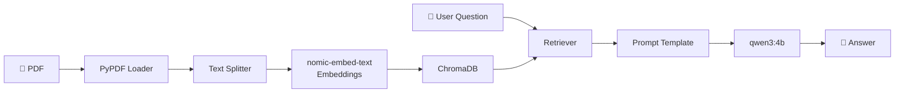

# 📄 TL;DR - Local PDF RAG Assistant

A local Retrieval-Augmented Generation (RAG) application that lets you chat with PDF documents entirely offline using Ollama, LangChain, and ChromaDB.

<p align="center">
  
</p>

---

## 📖 Overview

**TL;DR** was built as a learning project to understand how Retrieval-Augmented Generation (RAG) systems work under the hood.

Instead of simply sending a PDF to an LLM, the application builds a searchable knowledge base from the document. When a question is asked, only the most relevant parts of the PDF are retrieved and provided to the language model as context.

Everything runs locally using Ollama—no OpenAI API keys, no cloud services, and no data leaves your computer.

---

## 🚀 Features

- 📄 Upload PDF documents
- ✂️ Automatic document chunking
- 🧠 Local embeddings using **nomic-embed-text**
- 🗂️ Vector storage with **ChromaDB**
- 🔎 Semantic similarity search
- 💬 Chat interface built with Streamlit
- 🤖 Local LLM inference with Ollama
- 🔒 Fully offline

---

## ⚙️ How It Works

The application follows a standard RAG pipeline:

```text

```

### 1. Document Loading

The uploaded PDF is read using LangChain's PDF loader.

---

### 2. Text Chunking

Large documents are divided into smaller chunks.

Chunking improves retrieval quality because the model searches small sections of the document instead of the entire PDF.

---

### 3. Embeddings

Each chunk is converted into a numerical vector using **nomic-embed-text** running locally through Ollama.

These vectors capture semantic meaning rather than exact keyword matches.

---

### 4. Vector Database

The embeddings are stored in **ChromaDB**.

When the user asks a question, the application searches the vector database for the chunks that are most semantically similar to the query.

---

### 5. Retrieval-Augmented Generation

The retrieved chunks are inserted into the prompt and passed to **qwen3:4b**.

The model is instructed to answer **only** using the retrieved context and avoid making up information.

---

## 🛠 Tech Stack

| Component | Technology |
|-----------|------------|
| Language | Python |
| UI | Streamlit |
| Framework | LangChain |
| Embeddings | Ollama + nomic-embed-text |
| LLM | qwen3:4b |
| Vector Database | ChromaDB |
| PDF Processing | PyPDF |

---

## 💡 What I Learned

This project helped me understand the core components behind modern RAG systems, including:

- document preprocessing
- text chunking strategies
- embedding models
- vector databases
- semantic search
- prompt engineering
- LangChain pipelines
- integrating local LLMs with Ollama

More importantly, I learned **why** each component exists and how they work together instead of treating RAG as a black box.

---

## 🔮 Future Improvements

Some features I'd like to add in future versions:

- Support for multiple PDFs
- Source citations for every answer
- Conversation memory
- Better retrieval and reranking
- Document library
- Streaming responses
- Docker deployment

---

## 🖥 Running Locally

Clone the repository:

```bash
git clone https://github.com/issa-bagheryan/TL-DR.git
cd TL-DR
```

Install the dependencies:

```bash
pip install -r requirements.txt
```

Download the required Ollama models:

```bash
ollama pull qwen3:4b
ollama pull nomic-embed-text
```

Run the application:

```bash
streamlit run src/app.py
```

---

## 🎯 Purpose

This project wasn't built to create another ChatPDF clone.

It was built to understand the architecture behind modern AI applications by implementing the complete RAG pipeline from document loading to answer generation using entirely local models.
